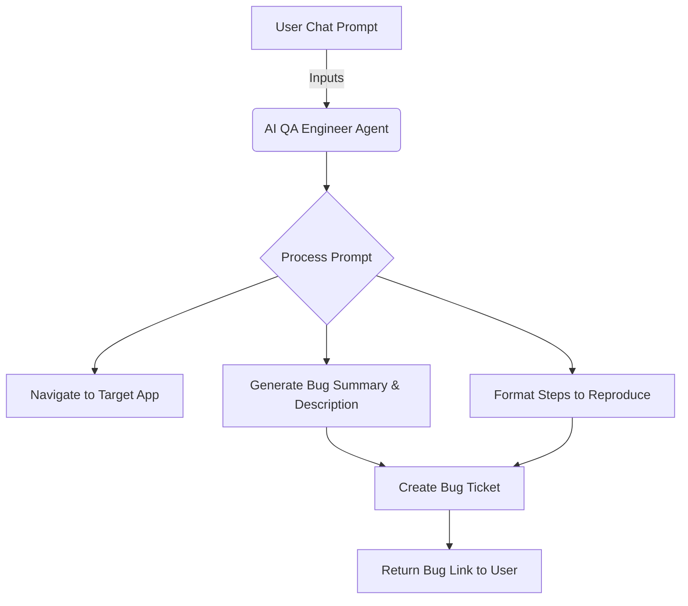
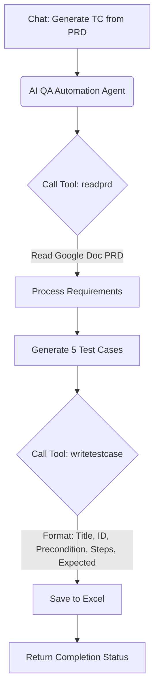

# n8n Workflows: Bug Creation & Test Case Generation

This repository contains two n8n workflow projects that utilize AI agents for QA automation tasks. These workflows automate the processes of bug reporting and test case generation from a Product Requirements Document (PRD).

## 1. AI Bug Creator Workflow

This workflow automatically creates a detailed bug report based on a user prompt provided via chat. It navigates to the target application, structures the bug details, and provides a direct link to the newly created issue.

### Files
- **Workflow:** `bug creator.json`
- **Prompt:** `bugcreator_prompt.md`

### Example Prompt
> "You need to go to the website www.saucedemo.com
> You need to create a bug which states .. even after entering valid user name and password we get error message stating invalid credentials. Please create nice bug summary and add the steps to reproduce in the description. Once done please share the bug link to access it."

### Workflow Diagram

---

## 2. Test Case Generator from Google Docs PRD

This workflow reads a Product Requirements Document (PRD) from Google Docs and automatically generates detailed test cases, saving them into an Excel format. It is designed to strictly follow formatting and quantity constraints.

### Files
- **Workflow:** `testcasegeneratorfromprdingoogledocs.json`
- **Prompt / Rules:** `testcasegeneratorfromgoogledocsprd.md`

### AI Agent Rules
- Call the `readprd` tool ONCE.
- Generate exactly 5 test cases.
- For each test case, call the `writetestcase` tool.
- Follow a strict JSON schema for the test cases (Title, ID, Precondition, Steps, Expected).
- Steps must contain at least 5 numbered steps.
- Output ONLY tool calls. No explanatory text.

### Workflow Diagram

